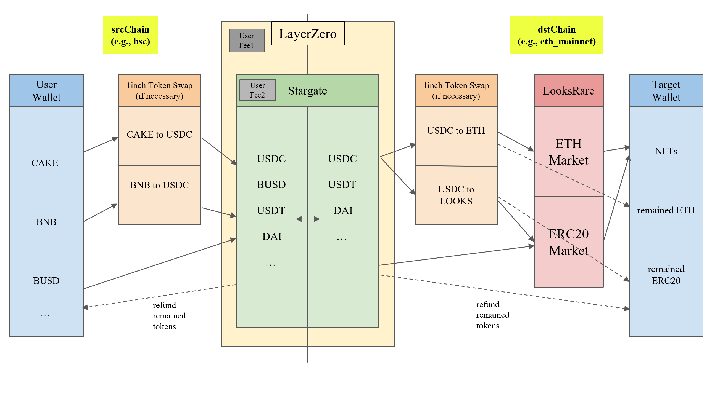

# OmniLooksRare

## Summary

OmniLooksRare is an EVM smart contract application that allows users to buy NFTs from LooksRare on the Ethereum mainnet using assets on a source chain (srcChain). The application uses Stargate dapp from LayerZero to facilitate cross-chain transactions and supports both ERC-721 and ERC-1155 NFT standards. Although the destination chain (dstChain) doesn't necessarily need to be Ethereum mainnet, at the moment, LooksRare only supports Ethereum mainnet.

## Features

1. Utilizes Stargate for cross-chain transactions and 1inch for token swaps if needed.
2. Requires only one transaction on srcChain.
3. Supports both ERC-721 and ERC-1155 NFTs.
4. Allows multiple NFT purchases at once through LooksRare.
5. Supports buying NFTs using various tokens like ETH, WETH, USDC, USDT, and LOOKS.
6. Handles errors and reverts on both srcChain and dstChain.

## How it works

1. User sends a single transaction on srcChain.
2. Stargate relayer exchanges tokens (if swap data is provided) and purchases NFTs.
3. NFTs are sent to the target wallet on dstChain.

## Error Handling

1. If an error occurs on srcChain (e.g., swap slippage is above the set value or incorrect data is entered), the transfer fails.
2. If there is no error on srcChain but an error occurs on dstChain, the handling depends on the type of error:
   - For most revert errors, the parameter token sent via Stargate is sent to the destination wallet on dstChain.
   - If there is an error in the swap, the same parameter token is returned or the swapped tokens may be returned depending on the given conditions.
   - When purchasing multiple NFTs on LooksRare, if only some of them are executable, the behavior depends on the specific conditions (a certain parameter set to true/false):
     1. Purchase the available NFTs, send the successfully purchased NFTs and any remaining tokens to the destination wallet.
     2. Do not purchase any NFTs and send all remaining tokens to the destination wallet.
3. When sending transactions on srcChain and purchasing and receiving NFTs on dstChain, any remaining balance (native token and ERC20 used) is returned to the refund wallet of each chain.

## Example Scenarios

Here are some example scenarios to help illustrate how OmniLooksRare works. All figures, including fees, are simple assumptions for the sake of these examples.

### 1. Simplest Case

**Assumption:** Alice has BNB and BUSD in her wallet on BSC. She wants to use BUSD to buy NFT_A, which is listed on Ethereum at 900 USDC.

1. Alice sends 910 BUSD with paying 0.2 BNB as a fee.
2. Stargate's relayer receives the fee and forwards Alice's transaction (message) to Ethereum.
3. 905 USDC arrives on Ethereum, excluding the Stargate fee. 900 USDC is used to purchase NFT_A, and the remaining 5 USDC, along with NFT_A, are sent to Alice's Ethereum wallet.

### 2. Most Complex Case

**Assumption:** Alice has BNB, BUSD, and CAKE in her wallet on BSC. She wants to use all these coins to buy NFT_A listed at 0.1 ETH, NFT_B listed at 0.2 WETH, and NFT_C listed at 2000 LOOKS on Ethereum, all at once.

1. Alice sends 1 BNB, 200 BUSD, and 100 CAKE, while paying 0.5 BNB as a fee.
2. Stargate's relayer receives the fee and forwards Alice's transaction (message) to Ethereum.
3. 890 USDC arrives on Ethereum, excluding the Stargate fee. 880 USDC of the 890 USDC is converted to 0.11 ETH, 0.22 WETH, and 2100 LOOKS via 1inch.
4. NFT_A, NFT_B, and NFT_C are purchased with the converted tokens and sent to Alice's Ethereum wallet. The remaining tokens (10 USDC, 0.01 ETH, 0.02 WETH, and 100 LOOKS) are also sent to Alice's Ethereum wallet.

## License

Distributed under the MIT License. See `LICENSE` for more information.

## Author

- [TheGreatHB](https://twitter.com/TheGreatHB_/)
